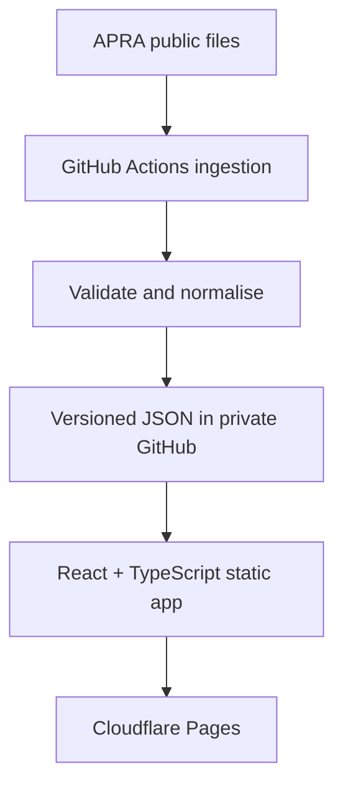

# Task 001 — Data Feasibility and Prototype Architecture

**Product:** Superannuation Research Adviser Prototype  
**Version:** V0.1  
**Date:** 11 August 2026  
**Status:** Feasible — proceed with controlled MySuper scope

## 1. Decision summary

V0.1 is feasible as an adviser-only, visual research prototype using public APRA data and no paid APIs.

The prototype should initially cover **APRA-regulated MySuper products and lifecycle stages only**. It can provide evidence-backed research matches and comparisons across fees, historical returns, growth allocation and APRA performance-test measures.

It must not present a fund as “recommended”, claim to assess every super product, treat growth allocation as a formal risk rating, or present an assumption-based scenario as a forecast.

## 2. APRA source decision

### Primary source — 2025 MySuper CPPP CSV

Use the APRA MySuper Comprehensive Product Performance Package (CPPP) CSV as the first prototype dataset.

Why it is suitable:

- Small, directly downloadable CSV suitable for automated ingestion.
- One row per MySuper product or lifecycle stage.
- Includes product and fund identity, growth allocation, APRA performance-test measures, 3/5/7/10-year returns and fees at representative balances.
- Best fit for quickly proving the Research Match and Compare experiences.

### Secondary source — Quarterly MySuper Statistics

Use after the CPPP parser is stable to add quarterly time-series information for historical performance visuals.

### Deferred source — Quarterly Superannuation Product Statistics (QSPS)

QSPS is valuable for broader product, investment-option, fee, strategy and asset-allocation coverage, but its CSV/XLSX files are substantially larger and more complex. It is not required for the first working slice.

### Source freshness at Task 001

- CPPP MySuper publication: 2025 data, published 19 January 2026.
- Quarterly MySuper Statistics: through March 2026, published 28 May 2026; APRA listed the June 2026 edition for August 2026.
- QSPS: March 2026, published 22 June 2026; APRA listed the June 2026 edition for September 2026.

Every screen must display the source name, reporting date, ingestion date and dataset version.

## 3. What APRA can and cannot support

| Adviser need | V0.1 status | Treatment |
| --- | --- | --- |
| Identify products and lifecycle stages | Supported | CPPP identity fields |
| Compare historical returns | Supported | Use like-for-like APRA return periods; show missing history |
| Compare fees by client balance | Supported with bands | Select the closest APRA representative balance: $10k, $25k, $50k, $100k or $250k |
| Compare growth exposure | Supported | Display strategic growth asset allocation |
| Show APRA performance-test result | Supported | Evidence field; never imply APRA endorsement |
| Formal risk rating or volatility | Not supported by initial source | Use “growth allocation proxy”, clearly labelled |
| Personal tax, insurance or contribution analysis | Not supported | Exclude from V0.1 score and screens |
| Forward outcome forecast | Not supported | Show adviser-controlled assumption scenarios only |
| Whole-of-market super comparison | Not supported in initial scope | State “MySuper research universe” |

## 4. Adviser workflow and screen data

### Research

Minimal inputs:

- Client age
- Current super balance
- Investment horizon: under 3, 3–5, 5–7, 7–10, or 10+ years
- Preferred growth range: Defensive (0–39%), Balanced (40–59%), Growth (60–79%), High growth (80–100%), or adviser-set range
- Priority sliders: fees, long-term performance and growth-range fit; defaults retain the approved score weights
- Optional: include lifecycle products

No client name, contact details, TFN, date of birth or other personal information is stored.

### Results

Show 3–5 Research Match cards with:

- Research Match Score and transparent component breakdown
- Product, fund and lifecycle stage
- Growth allocation proxy
- Fee at the nearest published APRA balance
- Relevant historical net return
- APRA performance-test result
- Data completeness and reporting date

### Compare

Compare up to three research matches using:

- Fee comparison bars
- Historical annualised return bars or time series when quarterly data is available
- Growth allocation versus adviser-selected range
- APRA performance-test measures
- Assumption-based balance scenarios using the same adviser inputs for every compared product

The scenario chart must expose assumptions and use neutral labels: lower, central and higher-return illustration. It must not extrapolate a product-specific expected return from past performance.

### Methodology

Display:

- Data sources and reporting dates
- Field definitions
- Score formula and weights
- Missing-data rules
- Balance-band selection rule
- Risk-proxy and scenario limitations
- “Research support only; not a fund recommendation” notice

## 5. Deterministic Research Match Score

Score each eligible record from 0–100 using fixed, inspectable rules.

| Component | Weight | Rule |
| --- | ---: | --- |
| Growth-range fit | 35 | 100 when within selected range; reduce linearly with distance from the nearest boundary; zero at 30 percentage points or more outside |
| Fee efficiency | 25 | Percentile score within the eligible MySuper universe using total fees at the nearest APRA balance; lower fee scores higher |
| Long-term net return | 25 | Percentile score using the longest common return period permitted by the client horizon and available across eligible products |
| APRA performance measure | 10 | Pass = 100; not assessed/insufficient history = 50 with warning; fail = excluded by default but adviser may reveal it |
| Data completeness | 5 | Percentage of required scoring fields present |

Formula:

`matchScore = round(0.35 × growthFit + 0.25 × feeScore + 0.25 × returnScore + 0.10 × performanceTestScore + 0.05 × completenessScore)`

Rules:

- Scores rank research relevance against the adviser’s selected inputs; they do not measure product quality in isolation.
- Products with missing growth allocation, applicable fee, or usable return history are not scored and appear in a separate “insufficient data” section.
- Ties are resolved by completeness, then lower fee, then product name.
- All eligible products use the same calculation and comparison period.
- The UI shows the component contribution so the score can be independently reproduced.

## 6. Normalised prototype data model

The processed JSON should expose a stable schema independent of APRA’s source column names.

```text
datasetMeta
  datasetId, sourceName, sourceUrl, reportingDate, publishedDate,
  ingestedAt, schemaVersion, recordCount, checksum

products[]
  productId, rseLicensee, rseName, productName,
  strategyType, lifecycleStageName, memberAssets, memberAccounts,
  growthAllocationPct, performanceTestMeasurePct,
  performanceTestResult, lookbackYears,
  returns.{3y,5y,7y,10y}.{netInvestmentReturnPct,netReturn50kPct},
  fees.{10k,25k,50k,100k,250k}.{administrationPct,totalPct},
  flags.{grossOfTax,insufficientHistory,missingFields}
```

Generate three browser-consumable files:

- `public/data/products.json` — normalised product records
- `public/data/metadata.json` — source/version/freshness details
- `public/data/validation.json` — row counts, null rates, duplicates and rejected rows

Do not commit the large raw APRA files into the application path. The workflow can download them during ingestion and retain only the source URL, checksum and processed outputs. A raw snapshot may be retained as a short-lived GitHub Actions artifact if later required for auditability.

## 7. Browser-only prototype architecture



### Repository structure

```text
super-research-adviser-prototype/
  .github/workflows/refresh-apra-data.yml
  ingestion/
    requirements.txt
    download.py
    transform.py
    validate.py
    mappings/cppp_mysuper.json
  public/data/
    products.json
    metadata.json
    validation.json
  src/
    pages/Research.tsx
    pages/Results.tsx
    pages/Compare.tsx
    pages/Methodology.tsx
    domain/score.ts
    domain/scenario.ts
    types/product.ts
  docs/
    Task_001_Data_Feasibility_and_Prototype_Architecture.md
  package.json
  README.md
```

### Browser-only operating model

- Create and manage the private repository on GitHub.com.
- Edit files through GitHub’s web editor or github.dev.
- Run ingestion, validation and build checks in GitHub Actions’ hosted environment; no local Python or Node installation is needed.
- Connect the private repository to Cloudflare Pages using GitHub authorisation.
- Cloudflare Pages builds the static app after approved commits.
- No application database, server, paid API or client record storage is required.

Cloudflare Pages hosting does not itself make a private GitHub repository’s website private. Access control is a later deployment decision; until it is configured, use synthetic client inputs and non-sensitive public APRA data only.

## 8. Ingestion and validation workflow

Run manually in V0.1; add a monthly schedule only after the source parser is stable.

1. Download the configured APRA CPPP CSV URL.
2. Record URL, timestamps and SHA-256 checksum.
3. Validate expected headers before processing.
4. Map APRA fields into the normalised schema.
5. Validate numeric ranges, required identifiers and duplicate product/stage keys.
6. Produce products, metadata and validation JSON.
7. Fail the workflow if headers changed, record count is unexpectedly low, duplicate keys exist, or critical-field null rates breach thresholds.
8. Create a pull request containing the refreshed JSON and validation summary; do not auto-publish changed data directly to the production branch.
9. Adviser/product owner reviews and merges through the browser.

Initial quality gates:

- At least 40 scored MySuper product/stage records.
- Unique key: RSE + product + lifecycle stage.
- Growth allocation between 0 and 100.
- Fee and return percentages parse as numbers or explicit nulls.
- No silent conversion of unavailable or suppressed values to zero.
- Validation report records every rejected row and reason.

## 9. Key risks and controls

| Risk | Control |
| --- | --- |
| APRA changes file URL or headers | Configuration mapping, header contract test and failed workflow alert |
| Lifecycle stages distort comparison | Treat each stage as a distinct research record and display the stage prominently |
| Score appears to be advice | “Research Match” terminology, visible formula, adviser-only use and no recommendation language |
| Historical performance is mistaken for expected return | Standard warning and neutral assumption-based scenarios |
| Growth allocation is mistaken for formal risk | Label it as a proxy and show the underlying percentage |
| Fee chosen from a representative balance differs from exact client fee | Show selected APRA band and the client-to-band mapping |
| Public preview exposes client information | Store no client records and use synthetic inputs only |
| Silent data-quality failure | Validation JSON, checksum, source date, null-rate checks and reviewed data PR |

## 10. Task 001 acceptance criteria

- [x] APRA data sources assessed and prioritised.
- [x] Supported and unsupported V0.1 claims identified.
- [x] Four-screen source-to-field mapping defined.
- [x] Deterministic score and missing-data rules specified.
- [x] Normalised JSON schema defined.
- [x] Browser-only ingestion, repository, validation and hosting architecture defined.
- [x] No paid API, backend database or local development dependency introduced.
- [ ] Confirm actual CPPP CSV headers through the first ingestion workflow run.
- [ ] Confirm scored record count and null rates from generated validation output.

## 11. Go/no-go decision and next task

**GO for prototype build**, subject to the two automated checks above.

Task 002 should create the private repository skeleton, add the ingestion workflow, run the first CPPP import, and publish the resulting validation report. UI development should begin only after that report confirms the actual usable field coverage.

## Official references

- APRA, MySuper Product Performance: https://www.apra.gov.au/mysuper-product-performance
- APRA, Quarterly Superannuation Statistics: https://www.apra.gov.au/news-and-publications/quarterly-superannuation-statistics
- APRA, Quarterly Superannuation Product Statistics: https://www.apra.gov.au/news-and-publications/quarterly-superannuation-product-statistics
- APRA, Superannuation Product Performance: https://www.apra.gov.au/superannuation/performance-and-transparency/superannuation-product-performance
