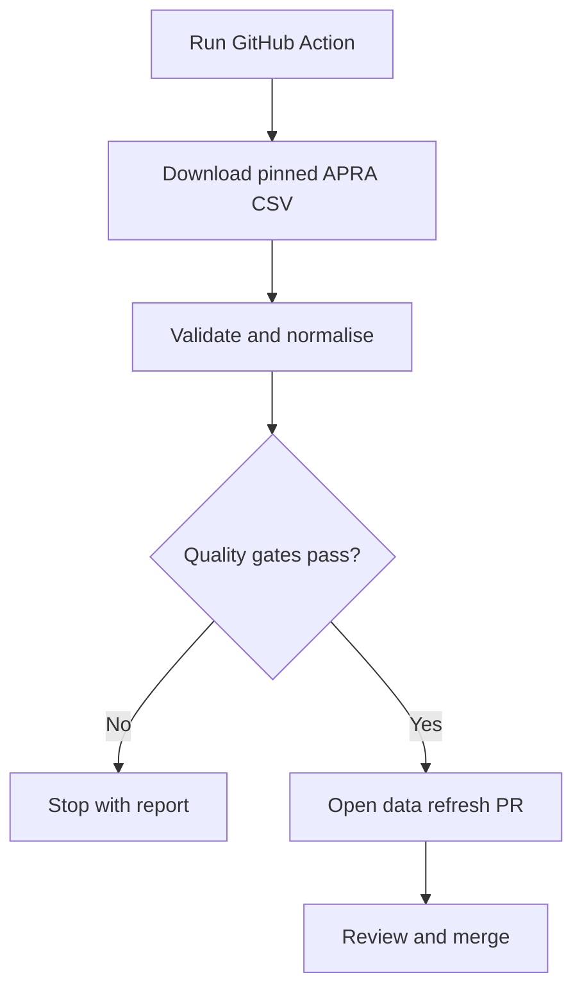

# Task 002 — Repository Skeleton and First APRA Ingestion

**Product:** Superannuation Research Adviser Prototype  
**Version:** V0.1  
**Date:** 11 August 2026  
**Status:** Build and validation complete; private repository publication pending

## Outcome

The first APRA ingestion is working and passes the prototype's data-quality gates. The implementation uses Python's standard library inside GitHub Actions, so the adviser/product owner needs only a web browser.

## Actual source findings

| Measure | Result |
| --- | ---: |
| APRA source rows | 384 |
| Retained product/lifecycle-stage records | 360 |
| Immediately scorable records | 317 |
| Lifecycle aggregate rows excluded | 24 |
| Rejected malformed rows | 0 |
| Duplicate product IDs | 0 |
| Source columns | 43 |
| Missing growth allocation among retained records | 0% |
| Missing $50k total fee among retained records | 0% |
| Missing 3-year return among retained records | 11.94% |

APRA percentage values are decimal fractions in the CSV. The normaliser converts them to percentage points: `0.71` becomes `71.0`, and `0.0675` becomes `6.75`.

## Lifecycle treatment

The source includes 24 lifecycle product-level aggregate rows with blank stage names, growth allocation and representative fees. Their lifecycle-stage rows contain the comparable data. V0.1 therefore excludes those 24 aggregate rows and retains each named lifecycle stage as its own research record.

The missing 3-year returns are retained as explicit null values, mainly representing limited history. They are never converted to zero. Forty-three retained records remain in the research universe but are not immediately scoreable under the initial critical-field rule.

## Implemented repository components

- Pinned APRA source configuration and reporting metadata
- Explicit source-column mapping
- Fail-closed 43-column header-contract validation
- Stable, non-identifying product IDs
- Percentage, number and missing-value normalisation
- Lifecycle aggregate exclusion rule
- Range, duplicate, row-count and null-rate quality gates
- Three browser-ready JSON outputs
- Automated workflow summary and data-refresh pull request
- Contract tests covering successful real output and header-change failure
- Browser-only README and safety boundary

No raw APRA file is committed. The workflow downloads it temporarily, records the SHA-256 checksum, and commits only the processed outputs.

## Browser workflow

## Quality-gate rationale

- Growth allocation and $50k total fee: no more than 5% null among retained records.
- 3-year return: no more than 25% null, because new/short-history stages are valid records but cannot yet be scored.
- At least 40 accepted and 40 scorable records.
- No duplicate stable IDs.
- No missing expected header or invalid growth percentage.

These thresholds are visible in `config/source.json` and are not hidden application logic.

## Acceptance criteria

- [x] Real APRA CSV downloaded and inspected.
- [x] Actual source headers confirmed.
- [x] Normalised JSON generated.
- [x] Usable/scorable counts and null rates measured.
- [x] Lifecycle aggregate handling documented.
- [x] Validation gates pass on the pinned source.
- [x] Browser-run GitHub Actions workflow created.
- [x] Contract tests pass.
- [ ] Create the new private GitHub repository and upload the verified skeleton.
- [ ] Run the workflow once in GitHub and review its first pull request.

## Next task

After repository publication and the first GitHub-hosted workflow run, proceed to **Task 003 — Adviser Research Screen and Research Match Score Engine**.

